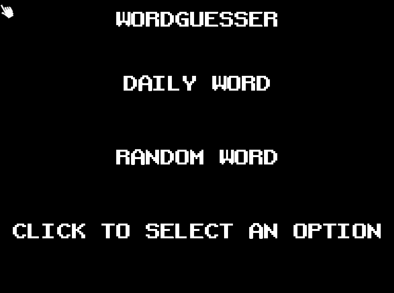
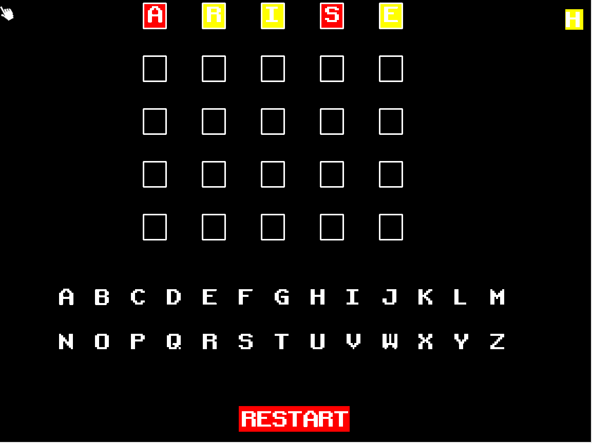
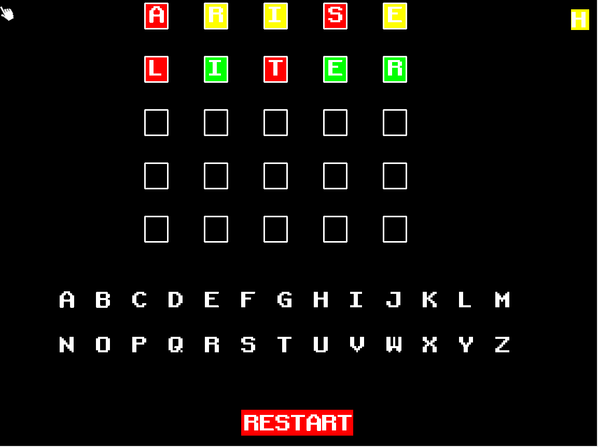
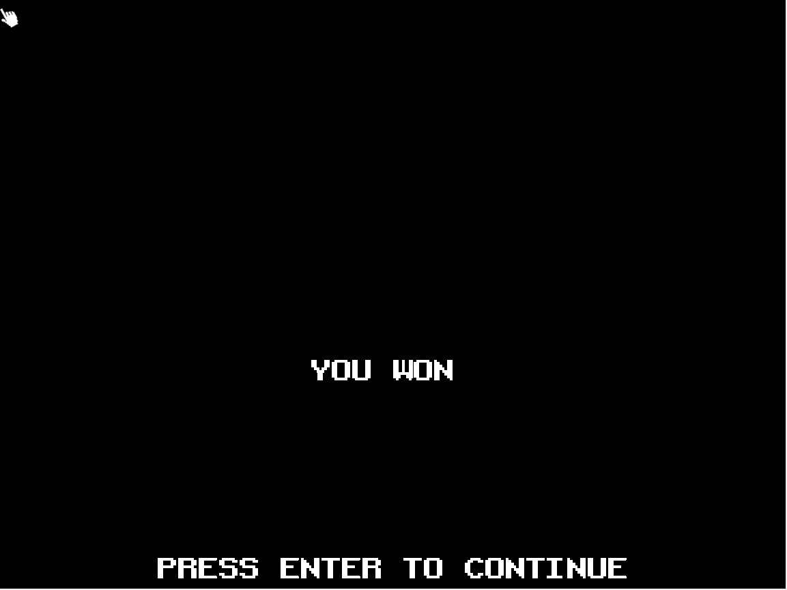

# WORDGUESSER

Word Guesser is based on the famous [Wordle](https://www.nytimes.com/games/wordle/index.html) game.
To keep it simple in this game, you have to guess a word. As you keep guessing, some letters might have different background colors.
- **Red** means that the letter doesn't belong to the word.
- **Yellow** means that the letter belongs to the word, but it's in the wrong place.
- **Green** means the letter is in the right spot.

The player wins if they guess the word in under 5 tries.

## The game contains 2 gamemodes!
1. **Daily word**: Here, there will be a word that changes each day.
2. **Random word**: The user can choose the length of the word to guess, and the word will change as you keep playing.

LCOM Project for group T&lt;m&gt;&lt;n&gt;G&lt;p&gt;&lt;q&gt;.

Group members:

1. André Santos (<up202108658@fe.up.pt>)
2. Tiago Oliveira (<up202009302@fe.up.pt>)
3. Tiago Martins (<up202206640@fe.up.pt>)
